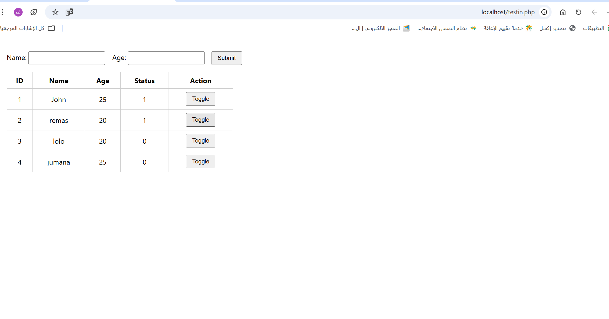
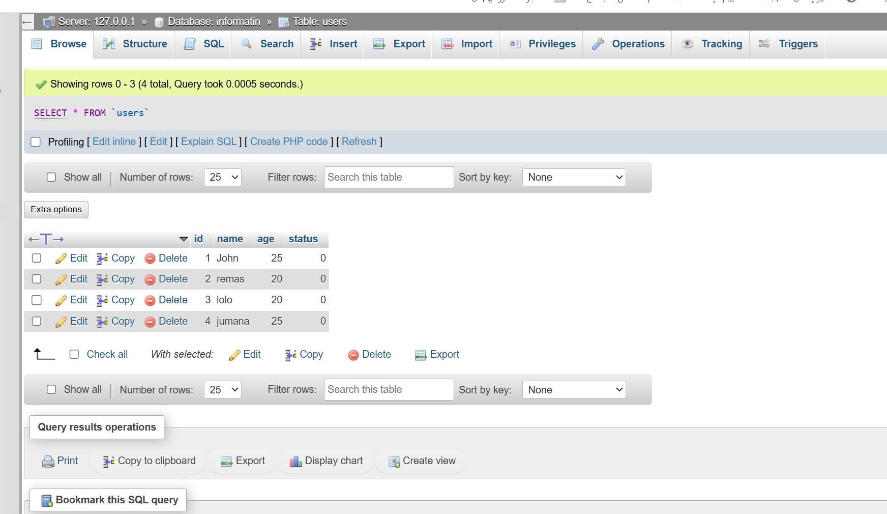

# PHP Webpage with MySQL Status Toggle

This project is a simple PHP web application that allows users to submit names and ages, view all records from a MySQL database, and toggle the status value (0 or 1) for each record directly from the webpage.

## Features
- Add a new user with **Name** and **Age**.
- Store submitted data into a **MySQL** database.
- Display all records in a table.
- Toggle each user’s **Status** between 0 and 1.
- Instantly refresh the webpage to show updated values.

## Technologies Used
- **HTML** – Structure of the webpage  
- **CSS** – Basic styling  
- **PHP** – Backend processing and database interaction  
- **MySQL** – Data storage  

## Screenshots

### Web Page

### Database View

## File Included
- `testin.php` 

       status TINYINT(1)
   );
